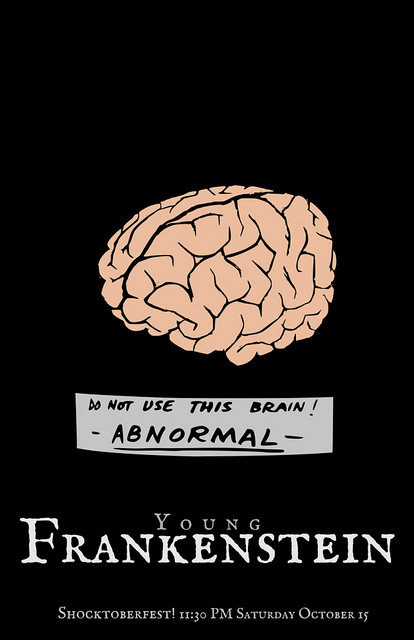

Title: Writing for WGO
Date: 2015-08-11T14:41:26-05:00
Modified: 2015-08-11T14:41:33-05:00
Author: Pat David

Oh good, you want to help us write content for the website!

First, check that you have what you need to build and view the website locally.
This is so you can check to make sure that what you write is correct, looks good, and doesn't break anything.

Instructions can be found on the [Building WGO page]({filename}../building/index.md).

Second, you may want to check with us on IRC to make sure that we can use what you want to submit.
I would imagine this is almost always going to be: "Go for it!" but it can't hurt to check before you get too far
into writing content.

## A Tutorial

This walk-through will assume you want to write a new tutorial for the site.
We will call this tutorial: `GIMP Test`.

### Directories

Pelican currently nests page directories as they exist in the source directories.
This means that if the source directories contain something like this:

`content/about/meta/index.html`

then the same file will be nested in its URL as:

`gimp.org/about/meta/index.html`

The main **Tutorials** index page can be located here:

`content/tutorials/index.md`

Or by it's URL:

`gimp.org/tutorials/`

This page will list each of the tutorials that are available.
They are all in self-contained directories below tutorials/.
For instance, the *GIMP_Quickies* tutorial is fully contained in the sub directory:

`content/tutorials/GIMP_Quickies/`

Our sample tutorial will need us to create a directory that we will call *GIMP-Test*:

`content/tutorials/GIMP-Test/`

The actual content for this tutorial will be contained in a file called *index.md* inside this directory:

`content/tutorials/GIMP-Test/index.md`

The tutorial content and all of its assets live inside the same folder.
This keeps all of the material together in a logical place and eases re-use.

### index.md

This tutorial assumes the file is a Markdown file, but could also be a reStructuredText or HTML file.
This is the content that will display when anyone visits the url for your tutorial at:

    gimp.org/tutorials/GIMP-Test/
    gimp.org/tutorials/GIMP-Test/index.html

#### Metadata

The file assumes that before any content the metadata is defined.
A property/value pair on each line.
The bare minimum metadata required is the *Title* attribute.
A good minimum would include *Title*, *Author*, *Date* and would look like this:

    Title: Gimp Test Tutorial
    Author: Pat David
    Date: 2015-08-11T15:22:12-05:00

    Hello World!
    I am the start of a tutorial.

#### File Content

Refer to the [Markdown cheatsheet]({filename}../markdown.md) for a more complete look at all of the formatting options.
More WGO/Pelican specific things are mentioned here.

##### Images

Images are included in a page as a `<figure>` and an optional `<ficaption>`.
The standard way of including an image into a page is:

    :::html
    <figure>
    
    <figcaption>
        An optional caption for the image
    </figcaption>
    </figure>

With image assets in the same directory as the index.md file, it is much easier to link/refer to them in the content.
For instance, the following refers to a local image "abby-normal.jpg" in the same directory as this index.md file:

    :::html
    <figure>
    
    <figcaption>
        A sample caption for a figure.
    </figcaption>
    </figure>

Which will render as:

<figure>

<figcaption>
    A sample caption for a figure.
</figcaption>
</figure>

The `<figure>` tag makes more semantic sense in describing a figure element that will usually be referred to by 
