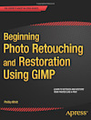

Title: Books About GIMP
Date: 2015-08-14T13:58:40-05:00
Author: Pat David
Status: hidden

## Beginning Photo Retouching & Restoration Using GIMP

**Author:** Phillip Whitt
 **ISBN-13:** 978-1-484204-04-7
 **Format:** Paperback (308pp.), EPUB, MOBI, PDF
 **Publisher/Date:** Apress/2014
 **Website:** [http://www.apress.com/9781484204047](http://www.apress.com/9781484204047)

**Description:** _Beginning Photo Retouching & Restoration Using GIMP_ teaches readers how to digitally retouch and restore damaged photographs with GIMP 2.8-the free high end alternative to expensive image editing programs. The exercise photos in the book are available to download for the reader to follow along.

## Das GIMP 2.8-Buch

  
**Author:** Kay Richter  
 **Format:** eBook, 256pp.  
 **ISBN-13:** 978-3-86899-857-3  
 **Publisher/Date:** O'Reilly/2013  
 **Website:** [www.oreilly.de/catalog/gimpbuchger/](http://www.oreilly.de/catalog/gimpbuchger/)  

**Description:** the book (in German) introduces readers to th basics of using GIMP, from importing to editing to printing.

## Niveles y Curvas con GIMP

  
**Author:** Alberto García Briz  
 **Format:** Paperback, 104pp.  
 **ISBN-10:** 1-48481-377-4  
 **ISBN-13:** 978-1-48481-377-5  
 **Publisher/Date:** CreateSpace/2013  
 **Website:** [www.createspace.com/4259936](https://www.createspace.com/4259936)  

**Description:** Explanations of histogram, levels and curves tools, towards their application for image improvement and advanced edition (traditional colouring, film simulation, etc.)

## The Book of GIMP

  
**Authors:** Olivier Lecarme, Karine Delvare  
 **Format:** Paperback, 676pp.  
 **ISBN-10:** N/A  
 **ISBN-13:** 978-1-59327-383-5  
 **Publisher/Date:** No Starch Press/2013  
 **Website:** [http://nostarch.com/gimp](http://nostarch.com/gimp)  

**Description:** GIMP is a free alternative to Adobe Photoshop with tons of professional-grade features. But with so many powerful tools and menu options, GIMP can be difficult to master. Whether you're struggling to get started or trying to master some of GIMP's more complex features, you'll find the answers you're looking for in The Book of GIMP.

## How to GIMP

  
**Author:** Kat Landreth  
 **Format:** PDF ebook  
 **ISBN-10:** N/A  
 **ISBN-13:** N/A  
 **Publisher/Date:** Self-published/May 2013  
 **Website:** [http://how-to-gimp.com/gimp-book/](http://how-to-gimp.com/gimp-book/)  

**Description:** A beginner's guide to using GIMP for photo editing, and basic graphics like using text on images. The book starts from the very beginning. You'll work through clearly written tutorials using over 30 high quality practice images to learn everything from drawing simple shapes, to using advanced tools like layers, and layer masks. You'll learn how to use tools effectively, rather than on memorizing steps in tutorials. By the end of the book, you'll be ready to follow and adapt online tutorials with ease. You'll even have the confidence to use GIMP without tutorials.

## Blanco y Negro con The GIMP

  
**Author:** Alberto García Briz  
 **Format:** Paperback, 232pp.  
 **ISBN-10:** 1-47835-391-0  
 **ISBN-13:** 978-1-47835-391-1  
 **Publisher/Date:** CreateSpace/2012  
 **Website:** [www.createspace.com/3954818](https://www.createspace.com/3954818)  

**Description:** This book (only available in Spanish) describes how to use free software GIMP for the conversion of digital pictures to black and white photography. Main methods are discussed and applied in multiple step-by-step examples.

## GIMP for Absolute Beginners

  
**Authors:** Jan Smith, Roman Joost  
 **Format:** Paperback, 352pp.  
 **ISBN-10:** 1-43023-168-8  
 **ISBN-13:** 978-1-43023-168-4  
 **Publisher/Date:** Apress/2012  
 **Website:** [www.apress.com/9781430231684](http://www.apress.com/9781430231684)  

**Description:** GIMP for Absolute Beginners gives us an easy way to use the power of GIMP, and enjoy digital photography and graphics without worrying about application features.

## GIMP

  
**Authors:** Olivier Lecarme, Karine Delvare  
 **Format:** Hardcover, 732pp.  
 **ISBN-10:** 2-74402305-1  
 **ISBN-13:** 978-2-74402305-7  
 **Publisher/Date:** Pearson Education/April 2011  
 **Website:** [http://www.pearson.fr/livre/?GCOI=27440100358850](http://www.pearson.fr/livre/?GCOI=27440100358850)  

**Description:** A complete user manual and a reference to GIMP features that explains basics of digital imaging, retouching photos, creating animations, preparing pictures for publishing on the Web etc.

## GIMP 2.6 Cookbook

  
**Author:** Juan Manuel Ferreyra  
 **Format:** Paperback, 408pp.  
 **ISBN-10:** 1-84951202-7  
 **ISBN-13:** 978-1-84951202-2  
 **Publisher/Date:** Packt Publishing/March 2011  
 **Website:** [https://www.packtpub.com/gimp-2-6-cookbook/book](https://www.packtpub.com/gimp-2-6-cookbook/book)  

**Description:** This book is packed with answers to get you preparing great images with the GIMP immediately. Even if you are a relative novice to this powerhouse application, the straightforward instructions will guide you through the tasks to unleash your true creativity without being hindered by the system.

## Beginning GIMP: From Novice to Professional, Second Edition

  
**Author:** Akkana Peck  
 **Format:** Paperback, 584pp.  
 **ISBN-10:** 1-43021-070-2  
 **ISBN-13:** 978-1-43021-070-2  
 **Publisher/Date:** Apress/December 2008  
 **Website:** [http://gimpbook.com/](http://gimpbook.com/)  

**Description:** A complete guide to image editing with GIMP, beginning with basic photo manipulation procedures, simple drawing and selection techniques, then proceeding to more advanced concepts such as layer masks, color adjustment, blending modes, stitching panoramas, image stacking, and writing simple GIMP scripts and plug-ins. The second edition adds more advanced tutorials and discusses some of the changes in GIMP 2.6\.

## GIMP for Textile Design

  
**Author:** Frederick L. Chipkin  
 **Format:** Spiral-bound, 112pp.  
 **ISBN-10:** 0-97273-172-5  
 **ISBN-13:** 978-0-97273-172-0  
 **Publisher/Date:** Origin inc/2008  
 **Website:** [http://origininc.tripod.com/GIMP/GIMP_BOOK_MAIN/GBOOK.htm](http://origininc.tripod.com/GIMP/GIMP_BOOK_MAIN/GBOOK.htm)  

**Description:** The book GIMP for Textile Design is a collection of lessons that will take you from simple textile design techniques to the more advanced design techniques needed to take on the most challenging textile design projects. Everything is explained in a simple uniform manner so that nothing is overwhelming to the textile designer just starting out and so that the more experienced textile designer can grasp key concepts more quickly.

## The Artist's Guide to GIMP Effects

  
**Author:** Michael J. Hammel  
 **Format:** Paperback, 348pp.  
 **ISBN-10:** 1-59327-121-2  
 **ISBN-13:** 978-1-59327-153-4  
 **Publisher/Date:** No Starch Press/August 2007  
 **Website:** [http://www.graphics-muse.org/artistsguide/](http://www.graphics-muse.org/artistsguide/)  

**Description:** The Artist's Guide To GIMP Effects is a tutorial filled expedition into the powerful open-source graphics design tool, the GNU Image Manipulation Program. Tutorials cover the gamut of design topics, from Web design and Photographic techniques to Advertising and Interface design. The Artist's Guide To GIMP Effects is the follow-up text to the first book ever published on GIMP, The Artist's Guide to the GIMP.

## GIMP 2 for Photographers: Image Editing with Open Source Software

  
**Author:** Klaus Gölker  
 **Format:** Paperback, 200pp.  
 **ISBN-10:** 1-93395-203-2  
 **ISBN-13:** 978-1-93395-203-1  
 **Publisher/Date:** Rocky Nook/November 2006  
 **Website:** [http://www.rockynook.com/books/20.html](http://www.rockynook.com/books/20.html)  

**Description:** This book has evolved from the classroom materials which the author developed and taught in courses and workshops on image editing with the GIMP. It covers the basics of image editing and guides the reader through the functions and tools of the GIMP from simple adjustments to more advanced techniques of working with layers and masks. The more important editing functions are presented in individual workshops. Moreover, the book covers the stitching of panoramic images and preparation of high-quality black and white images.

## Beginning GIMP: From Novice to Professional

  
**Author:** Akkana Peck  
 **Format:** Paperback, 552pp.  
 **ISBN:** 1-59059-587-4  
 **Publisher/Date:** Apress/May 2006  
 **Website:** [http://gimpbook.com/](http://gimpbook.com/)  

**Description:** A complete guide to image editing with GIMP, beginning with basic photo manipulation procedures, simple drawing and selection techniques, then proceeding to more advanced concepts such as layer masks, color adjustment, blending modes, stitching panoramas, image stacking, and writing simple GIMP scripts and plug-ins. Covers version 2.2 plus a look ahead to 2.4.

## The Gimp 2.2 pour PC, Mac et Linux

  
**Author:** Julien Pons  
 **Format:** Paperback, 300pp.  
 **ISBN:** 2746028565  
 **Date:** October 2005  
 **Website:** [http://www.julienpons.fr](http://www.julienpons.fr/)  

**Description:** An in-depth reference for GIMP that, like the rest of French publisher ENI's Studio Factory series, is aimed at the professional user. This book covers the interface, GIMP functions, and GIMP concepts such as layers and drawables, and also includes a chapter for Photoshop users migrating to The GIMP.

## GIMP - Guia do Usuário

  
**Author:** André Milani  
 **Format:** Paperback, 336pp.  
 **ISBN:** 85-7522-077-2  
 **Date:** September 2005  
 **Website:** [http://www.novatec.com.br/livros/gimp](http://www.novatec.com.br/livros/gimp/)  

**Description:** First Brazilian book about GIMP. Features detailed explanations about GIMP and its tools, how to use layers, and includes some tutorials on web graphics and photo retouching.

## (A la) SOS GIMP

  
**Author:** Cédric Gemy  
 **Format:** Paperback, 256pp.  
 **ISBN:** 2-9521703-1-2  
 **Date:** January 2005  
 **Website:** n/a  

**Description:** This book in French, released under the Free Documentation License, contains loads of tips and tutorials for GIMP, as well as giving a thorough tour of the main tools and features. It is in its second edition, and has recently been updated to cover GIMP 2.2.

## Essential GIMP for Web Professionals

  
**Author:** Michael J. Hammel  
 **Format:** Paperback, 376pp.  
 **ISBN:** 0-130-19114-0  
 **Publisher/Date:** Pearson Education/April 2001  
 **Website:** [http://authors.phptr.com/essential/gimp/](http://authors.phptr.com/essential/gimp/)  

**Description:** This concise, example-rich guide shows Web professionals exactly how to create high-quality graphics with GIMP. It delivers no-nonsense, practical coverage based on real-world projects you can see and download from the above mentioned web site. Master layers, selections and masks, text, color management, drawing, painting, image maps, animation, working from scans, using effects and rendering filters - even scripting.

## GIMP Pocket Reference

  
**Author:** Sven Neumann  
 **Format:** Paperback, 97pp.  
 **ISBN:** 1-565-92731-1  
 **Publisher/Date:** O'Reilly & Associates, Incorporated/August 2000  
 **Website:** [http://shop.oreilly.com/product/9781565927315.do](http://shop.oreilly.com/product/9781565927315.do)  

**Description:** The GIMP Pocket Reference explains the numerous features of the GNU Image Manipulation Program - and is the essential guide for designers working in a Linux/Unix environment. This handy reference covers GIMP version 1.2\. It explains the function of every menu item and offers tips for everyday use. The GIMP Pocket Reference is available in English, German, Dutch and French versions.

## Grokking the GIMP

  
**Author:** Carey Bunks  
 **Format:** Paperback, 352pp.  
 **ISBN:** 0-735-70924-6  
 **Publisher/Date:** Pearson Education/February 2000  
 **Website:** [http://gimp-savvy.com/BOOK/index.html](http://gimp-savvy.com/BOOK/index.html)  

**Description:** Grokking the GIMP is for the serious user of the GNU Image Manipulation Program, a premiere digital image editing and painting program. It covers GIMP in depth, and complex tasks are intuitively presented and explained using an interactive approach. In addition to emphasizing the theory and core concepts of image manipulation, Grokking the GIMP beautifully illustrates the practical aspects of working with digital images. This fully 4-color book presents nine major projects and a collection of many smaller ones that illustrate the core and advanced uses of this powerful open-source application. Numbered steps and an abundance of color images walk the reader through real-world examples of color correction, image enhancement, collage, photo montage, rendering, and web-graphics creation. The entire book is available on-line at the above mentioned website.

## Guerilla Guide to Great Graphics with The GIMP

  
**Author:** David D. Busch  
 **Format:** Paperback, 370pp.  
 **ISBN:** 0-7615-2407-X  
 **Publisher/Date:** Premier Press (Prima Tech)/January 2000  
 **Website:** N/A  

**Description:** Guerrilla Guide to Great Graphics with the GIMP shows beginning-to-advanced image designers creative ways to transform ordinary images into triumphant prizewinners using the most popular graphics package for Linux. It also shows non-designers how to create or manipulate graphics for many uses. This book is filled with easy-to-follow techniques and tips for using the advanced features that will spark your creativity and lead to amazing graphics.

## GIMP - The Official Handbook

  
**Authors:** Olof S. Kylander, Karin Kylander  
 **Format:** Paperback, 895pp.  
 **ISBN:** 1-576-10520-2  
 **Publisher/Date:** Coriolis Value/November 1999  
 **Website:** n/a  

**Description:** Comprehensively covers the program by teaching readers all aspects ranging from installing, to scripting, to working faster and more efficiently through shortcuts. Thoroughly covers one of the most powerful aspects of GIMP filters, including how to create images invoking Cubism, Van Gogh, embossing, warping, rippling, glass tile, and fractals. While this book does not teach readers how to be artists, it offers plenty of examples to inspire new ideas and grab on to the power and versatility of the application. Gimp: The Official Handbook is written by two Gimp experts and is the most comprehensive source of information available on this freely distributed image-manipulation program for the Open Source community. The only book to teach the entire program, including all built-in filters and third-party plug-ins. Beats the competition by teaching the program from cover to cover. Other books gloss over key features and focus on learning the program quickly, or are theoretical and provide no practical information on the product.The entire book is available on-line at the aforementioned website.

## GIMP Essential Reference

  
**Author:** Alex Harford  
 **Format:** Paperback, 373pp.  
 **ISBN:** 0-735-70911-4  
 **Publisher/Date:** Pearson Education/November 1999  
 **Website:** N/A  

**Description:** Gimp Essential Reference will show users how to quickly become familiar with the advanced user interface using a table-heavy format that will allow users to find what they're looking for quickly. Gimp Essential Reference is for users working with GIMP who know what they want to accomplish, but don't know exactly how to do it.

## The Artists' Guide to the GIMP

  
**Author:** Michael J. Hammel  
 **Format:** Paperback, 340pp.  
 **ISBN:** 1-578-31011-3  
 **Publisher/Date:** Specialized Systems Consultants, Incorporated/December 1998  
 **Website:** [http://www.artistsguidetogimp.com/](http://www.artistsguidetogimp.com/)  

**Description:** The Artists' Guide to the GIMP covers all of the basics a new user needs to get started, from detailed descriptions of Toolbox features to using selections to a complete explanation of Layers and Channels. Chapters on color functions and drawing and painting methods show how to make the most of this wonderful alternative to similar applications for other platforms. Several examples of plug-ins high resolution, four-color glossy prints serve as tutorials and inspiration to any reader. Add to these the extensive discussions on printing and scanning, and the result is a text that will be an integral part of any graphic artist's tool chest.

## The Artist's Guide to GIMP, 2nd Edition

  
**Author:** Michael J. Hammel  
 **Format:** Horizontal, 320pp.  
 **ISBN-10:** 1593274149  
 **ISBN-13:** 978-1-59327-414-6  
 **Publisher/Date:** No Starch Press/June 2012  
 **Website:** [http://nostarch.com/gimp2](http://nostarch.com/gimp2)  

**Description:** The Artist's Guide to GIMP teaches you how to use GIMP without a tedious list of menu paths and options. Instead, as you follow along with Michael J. Hammel's step-by-step instructions, you'll learn to produce professional-looking advertisements, apply impressive photographic effects, and design cool logos and text effects. These extensively illustrated tutorials are perfect for hands-on learning or as templates for your own artistic experiments.

