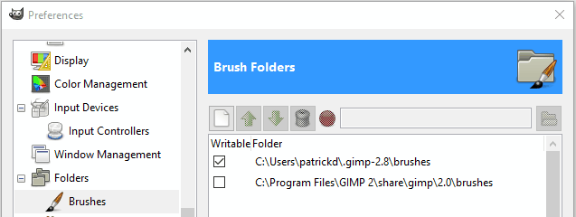

Title: Your GIMP Profile and You
Date: 2016
Modified: 2016-09-04T20:54:21-05:00
Author: Ofnuts
Template: page_author

## What is my "Gimp profile" and where do I find it?
The "Gimp profile" is a directory/folder (actually a directory tree) where Gimp keeps information that pertains to you, the user:

* your windows and dialogs setup
* your settings and presets for some tools
* your keyboard shortcuts
* your brushes, gradients, palettes, patterns, fonts, scripts, plugins and brush dynamics (as opposed to those installed for the benefits of all users).

### Locating the Gimp profile

Since it is a personal folder, Gimp keeps it with others files that also belong to you, usually:

* In Windows XP:  
    `C:\Documents and Settings\{your_id}\.gimp-2.8`  
    (ie, a "sibling" of "Application Data" and "My Documents")
* In Vista, Windows 7 and later versions:  
    `C:\Users\{your_id}\.gimp-2.8`  
    (ie, a "sibling" of "Application Data" and "My Documents")
* In Linux:  
    `/home/{your_id}/.gimp-2.8`  
    (a.k.a. `~/.gimp-2.8`)
* In OSX:  
    `/Users/{your_id}/Library/GIMP/2.8/`  
    or possibly  
    `/Users/{your_id}/Library/Application Support/GIMP/2.8/`  
    (this could depend on the Gimp build you use).

The `.gimp-2.8` part is of course version-dependent, so in the near future you may have to look for `.gimp-2.9` (or you may still be using `.gimp-2.6`). 
If you run several versions in parallel, you will have a profile for each, i.e., distinct profiles for Gimp 2.6 and Gimp 2.8, while all the successive updates to Gimp 2.8 will use the same profile.

#### If you don't find it in the locations above

* If you are on Linux or OSX, keep in mind that the leading dot in the name makes many tools "omit" to display it, 
so you may have to explicitly ask your file explorer to display hidden files to navigate to it.
* On all systems (and especially Windows versions), it can be elsewhere for several reasons, 
for instance because the user profile has been moved to another partition/drive (especially with "roaming" users). 

Here are two tricks to find it (they both assume that Gimp can run):

##### Trick #1

* *Edit → Preferences* and open the *Folders* tree in the left pane of the dialog.
* If you click on any of the folders (for instance, Brushes), the right pane will normally display two folders:
    <figure></figure>
    * The non-writable one is the one that holds system-wide features (brushes in this case), located somewhere in the Gimp installation tree
    * The writable one is your own brushes folder in your Gimp profile: the Gimp profile is its parent folder.

##### Trick #2

* Open Filters/Python-fu/Console
* Enter this: `print gimp.directory` and srtoke [Enter]

### When to use the Gimp profile

Your Gimp profile is the right place to install additional material (scripts, plugins, brushes, palettes, fonts, gradients...). 
It is a much better place than the system Gimp installation folder:

* Installing things there will not require admin privileges
* The additional items will not be wiped out by a Gimp re-installation
* They are more likely to be backed up since they are part of the user's data

### Repairing the Gimp profile

Gimp Startup failures can be caused by profile problems. In that case it is pointless to re-install Gimp,
since the re-installed version will re-use the existing profile and therefore fail in the same way.

It is usually much more efficient to just rename the profile (to `.gimp-2.8.disabled`, for instance) and restart Gimp.
Gimp will recreate a new profile directory on startup, which should fix any problems. 

You can then copy your add-ons subdirectories to the new profile, checking periodically that Gimp will still start
with that modified profile.

<small>

 
GIMP Tutorial - Your GIMP Profile and You by Ofnuts is licensed under a [Creative Commons Attribution-ShareAlike 3.0 Unported License](http://creativecommons.org/licenses/by-sa/3.0/deed.en_US).</small>
