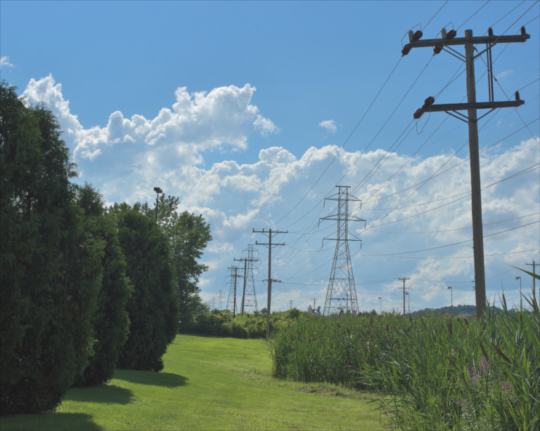
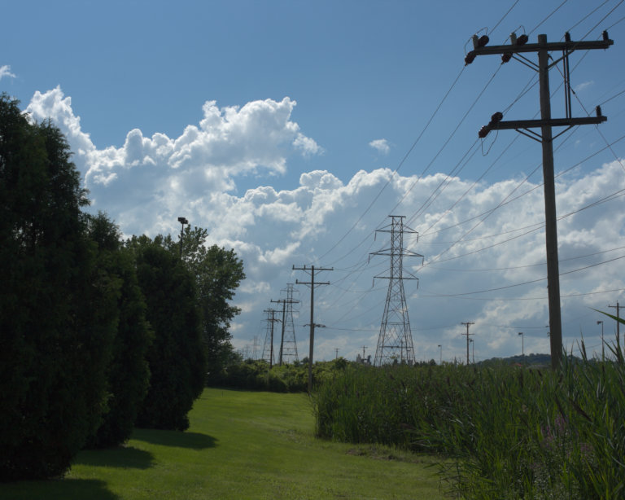
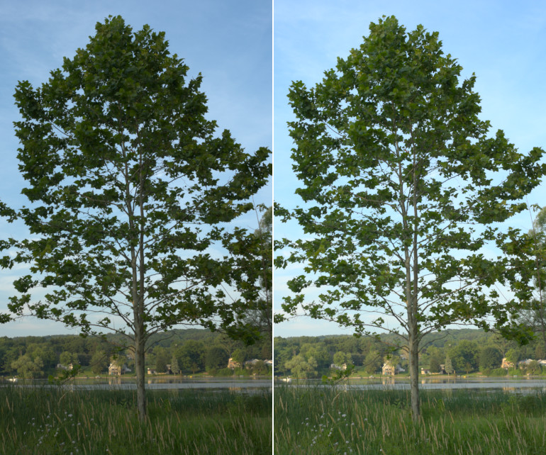
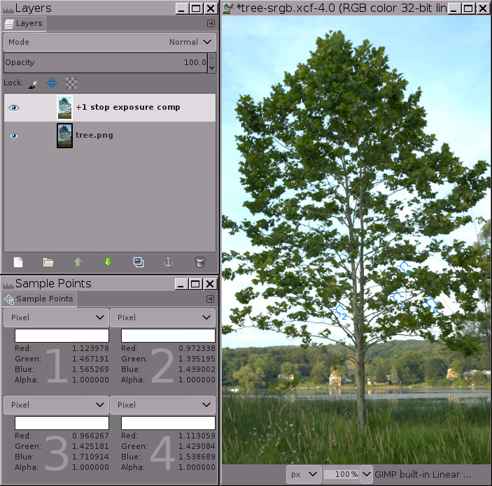
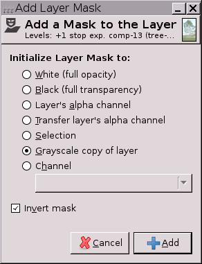
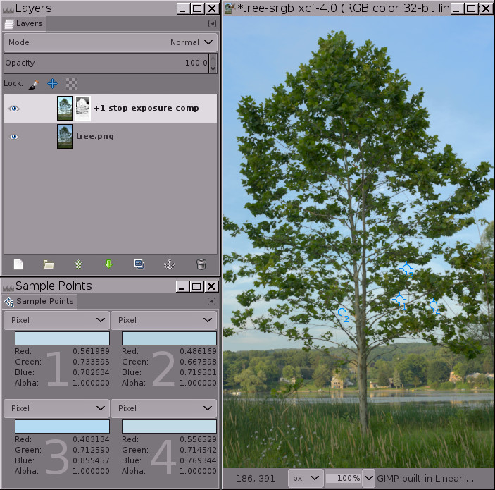
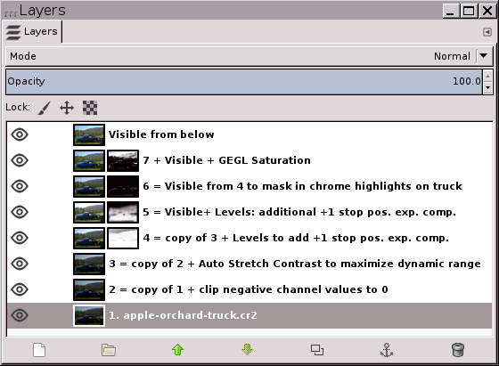
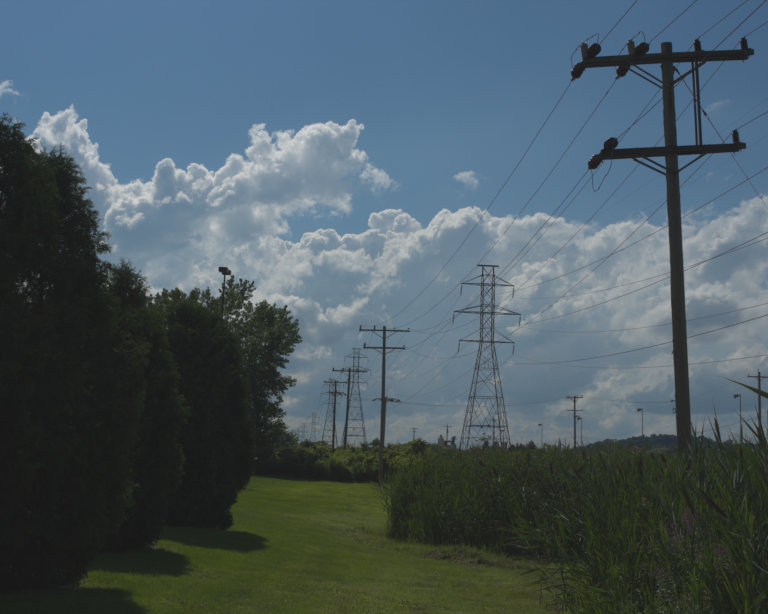
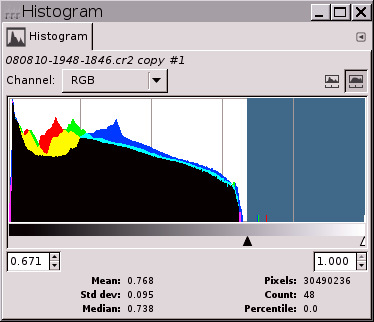
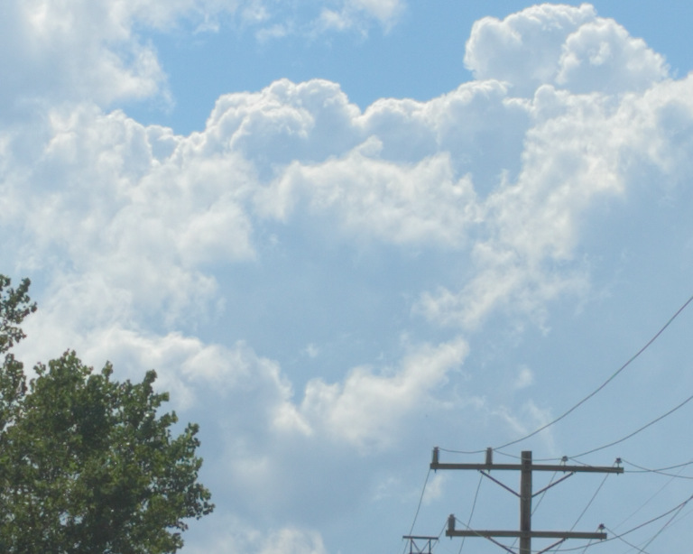

Title: Tone Mapping and Shadow Recovery Using GIMP's 'Colors/Exposure'
Date: 2016-03
Modified: 2016-03
Author: Elle Stone
Template: page_author
canonical: http://ninedegreesbelow.com/photography/gimp-tone-map-with-levels.html

<small>

GIMP Tutorial - Tone Mapping Using GIMP Levels (text & images) by [Elle Stone](http://ninedegreesbelow.com/) is licensed under a [Creative Commons Attribution-ShareAlike 3.0 Unported License](http://creativecommons.org/licenses/by-sa/3.0/).
</small>

<link rel='stylesheet' type='text/css' href='index.css'>

<!-- BEGIN ARTICLE -->

A very common editing problem is how to lighten the shadows and midtones of an image while retaining highlight details, a task sometimes referred to as "shadow recovery" and more generally speaking as "tone mapping". This step-by-step tutorial shows you how to use high bit depth GIMP's floating point "Colors/Exposure" operation to add one or more stops of positive exposure compensation to an image's shadows and midtones while retaining highlight details.

**Page Contents**

[TOC]

## High bit depth GIMP's floating point "Colors/Exposure": much better than Curves for lightening the shadows and midtones of an image without blowing the highlights

A very common editing problem is how to lighten the shadows and midtones of an image without blowing out the highlights, which problem is very often encountered when dealing with photographs of scenes lit by direct sunlight. Precanned algorithms for accomplishing this task are often referred to as "shadow recovery" algorithms. But really these algorithms are special-purpose tone-mapping algorithms, which sometimes work pretty well, and sometimes not so well, depending on the algorithm, the image, and your artistic intentions for the image.

This step-by-step tutorial shows you how to use GIMP's unbounded floating point "Colors/Exposure" operation to recover shadow information&mdash;that is, add one or more stops of positive exposure compensation to an image's shadows and midtones&mdash;without blowing out or unduly compressing the image highlights. The procedure is completely "hand-tunable" using masks and layers, and is as close as you can get to non-destructive image editing using high bit depth GIMP 2.9/2.10.

<figure>

<figcaption>
<em><strong>Power lines at noon</strong></em>, before and after tone mapping (aka "shadow recovery") using high bit depth GIMP's floating point "Colors/Exposure". 
(Click to view): 
Scene-referred interpolated raw file. 
After tone mapping/shadow recovery using GIMP unbounded Levels.
</figcaption>
</figure>

<noscript>
<figure>

<figcaption>
Scene-referred interpolated raw file.
</figcaption>
</figure>
</noscript>

<!-- 
Accepted wisdom is that Curves provides more versatility than Levels for modifying image tonality. Of course you can use Curves to accomplish somewhat similar results to the procedure described in this tutorial. But GIMP Curves is a highly destructive editing operation, immediately "baking" the resulting tonality into the layer on which Curves is done, clipping any out of gamut RGB values, and leaving you with no way to fine-tune the results without starting over. -->

Hight bit depth GIMP is my primary image editor, and I've used the procedure described below for the last couple of years as my "go to" way to modify image tonality. The same general procedure can be used to darken as well as lighten portions of an image, again controlling the effect using a layer mask. This isn't exactly nondestructive editing because at some point you need to make a "New from Visible" layer. But unlike using Curves, using high bit depth GIMP's floating point "Colors/Exposure" doesn't clip RGB channel values and allows you to fine-tune the results by modifying and re-modifying the layer mask until you are completely happy with the resulting tonality.

## A step-by-step example showing how to recover shadow information using high bit depth GIMP's floating point "Colors/Exposure"

<figure>

<figcaption>
Using high bit depth GIMP's "Colors/Exposure" to lighten the ground by one stop without blowing out portions of the sky.

<ul>
<li><em>Left:</em> The original image, an interpolated camera raw file that was deliberately underexposed in camera to avoid blowing out the sky. It might not appear to be the case, but this image is already very close to having out of gamut RGB channel values in the sky, and a simple Auto Stretch Contrast won't lighten the image at all.</li>
<li><em>Right:</em> The same image after using high bit depth GIMP's "Colors/Exposure" at 32-bit floating point linear precision to add one stop of positive exposure compensation. An inverse grayscale mask was used to keep the highlights from blowing out.</li>
</ul>

</figcaption>
</figure>

This step-by-step example provides a sample image and is broken down into five steps, starting with downloading the image. Steps 3, 4, and 5 describe the actual procedure, so here's an overview:

<ol start='3' class='italic' markdown=1 >
3. Duplicate the base layer and then use GIMP's unbounded Levels to add one stop of positive exposure compensation to the duplicated layer.
4. Add an inverse grayscale layer mask to the now much brighter duplicated layer.
5. Do "Auto/Stretch Contrast" on the layer mask and then fine-tune the mask until you are happy. Then make a "New from Visible" layer.
</ol>

---

<ol markdown=1>

<li><b>Download <a href="tree.png">tree.png</a></b>, which is a 16-bit integer sRGB image. High bit depth GIMP really is an "sRGB only" image editor, so it's best if you don't even try to edit in other RGB working spaces.</li>

<li><b>Open tree.png with GIMP and assign the GIMP built-in sRGB profile (the image colors won't change a bit). Then convert the image to 32-bit floating point linear precision</b>: Go to "Image/Precision", select "32-bit floating point", and when the Dither dialog pops up, select "Linear light" (this ensures that the Normal blend mode produces radiometrically correct results).</li>

<li markdown=1> 
Make a copy of the "tree.png" layer, and label it "+1 stop exposure comp". Then <b>use "Colors/Exposure" to add one stop of positive exposure compensation</b>&mdash;Figure 3 below shows the proper settings for the "Colors/Exposure" dialog, and Figure 4 shows the result:

<figure>

<figcaption>
Using "Colors/Exposure" to add one stop of positive exposure compensation.
</figcaption>
</figure>

When using "Colors/Exposure" to add one stop of positive exposure compensation, make sure the image really is at floating point precision, because integer precision will clip the highlights.

<figure>

<figcaption>At floating point precision, GIMP's "Colors/Exposure" operation is unbounded. This means you can use "Colors/Exposure" to add positive exposure compensation without blowing out the highlights. 

Notice the RGB channel values for the four sample points: the channel information that would have been clipped using integer precision is encoded using channel values that are greater than 1.0 floating point.

</figcaption>
</figure>

The image in Figure 4 clearly has "blown" highlights in the sky. But the highlights aren't really blown (that is, clipped to 1.0 in one or more channels). Instead the highlight information is still there, but the RGB channel values fall outside the RGB <a title="Models for image editing: Display-referred and scene-referred." href="http://ninedegreesbelow.com/photography/display-referred-scene-referred.html">display channel value range</a> of 0.0f to 1.0f. The sample points dialog in Figure 4 above shows four sample points that have RGB channel values that are greater than 1.0. As shown in Figure 5 below, adding a mask allows you to recover these highlights by bringing them back down into the display range. 

If you had used integer precision instead of floating point, the highlights really would be blown: The sample points would have a maximum channel values of 255, 65535 or 4294967295, depending on the bit depth. And masking would only "recover" a solid expanse of gray, completely lacking any details (try for yourself and see what happens).

</li>

<li>

<b>Add an inverse grayscale layer mask</b>: Right-click on the layer and select "Layer/Mask/Add Layer Mask", and when the "Add a mask to the Layer" dialog pops up, choose "Grayscale copy of layer" and check the "Invert mask" box. 

As shown in Figure 5 below, at this point the highlights will be brought back into the display range, meaning all RGB channel values are between 0.0f and 1.0f. But the image will probably look a little odd (sort of cloudy and flat), and depending on the image, the brightest highlights might actually have dark splotches&mdash;don't worry! this is temporary.

 
<figure >

<figcaption>Result of adding an inverse grayscale layer mask to bring the highlights back into the display range. 

Adding an inverse grayscale layer mask brings the highlights back into the display range, but at this point most images will look flat and cloudy, and some images will have dark splotches in the highlights. The next step&mdash;"Auto Stretch Contrast" performed on the mask&mdash;will take care of this problem.

</figcaption>
</figure>
</li>

<li>

<b>Click on the layer mask to select it for editing, and then select "Colors/Auto/Stretch Contrast"</b>: 

"Keep Colors" should be checked (though it doesn't really matter on grayscale images such as layer masks). Figure 6 below shows the final result:

<figure>

<figcaption>Doing "Auto/Stretch Contrast" on the layer mask removes the "cloudy" appearance, leaving a nicely brightened image with intact highlights. 
"Auto/Stretch Contrast" on the mask is necessary because just like the image layer has out of gamut RGB channel values, the inverted grayscale mask contains out of gamut grayscale values. "Auto/Stretch Contrast" brings all the mask grayscale values back into the display range, allowing the mask to proportionately compensate for the layer's otherwise out-of-gamut RGB channel values, masking more in the layer highlights and less/not at all in the image's shadows and midtones.

Notice that one of the sample points still has a blue RGB channel value that is slightly out of gamut. The easiest way to deal with this is to "Colors/Exposure" to make a Gamma adjustment of 0.45 <i>on the mask</i>, not on the actual image layer. You can make this Gamma adjustment either on the entire mask (works well, less effort). Or else you can make the adjustment just on the mask shadows (which correspond to the layer highlights), in which case you'd load the mask as a selection, invert the selection, and make the Gamma adjustment. Or if the remaining out of gamut channel values are only very slightly out of gamut, make a "New from Visible" layer and then "Auto/Stretch Contrast" the result to bring the remaining channel values back into gamut.
</figcaption>
</figure>
</li>

</ol>

That's the whole procedure for using "Colors/Exposure" to add a stop of positive exposure compensation to the shadows without blowing out the highlights. Now you can either fine-tune the mask, or else just make a "New from Visible" layer and continue editing your nicely brightened image. Depending on the image and also on your artistic intentions for the image, the mask might not need fine-tuning. But very often you'll want to modify the resulting tonal distribution by doing a "Colors/Exposure" gamma correction, or perhaps a Curves operation on the mask, or else by painting directly on the mask. And sometimes you'll want to blur the mask to <a href="#blur-to-restore-micro-contrast">restore micro contrast</a>.

## Use Notes
<ol class="double-space">

<li>Depending on your particular artistic intentions for an image, <b>some images are more likely than others to benefit from being tone mapped using floating point "Colors/Exposure".</b> Your mileage may vary, but typically the procedure described on this page works best for photographs of scenes with a pronounced tonal difference between the highlights and shadows, as per typical sunny day "sky-ground" photographs.</li>

<li><b>For adding just one stop of positive exposure compensation, the procedure described on this page works really well.</b> Depending on the image you might want to blur the mask using an edge-respecting blur algorithm, and/or tweak the mask using "Colors/Exposure", Curves, etc. But only modify the mask <i>after</i> using Auto Stretch Contrast on the mask. Otherwise results will be unpredictable: <a href="http://ninedegreesbelow.com/photography/unbounded-srgb-levels-gamma-slider.html">Gamma adjustments produce odd results when operating on out of gamut values</a>, and Curves will summarily clip out of gamut values.</li>

<li><b>For adding more than one stop of exposure compensation, you can use one or more than one positive-exposure-compensation layers.</b> Either way the layer mask(s) will need careful tweaking that's very image-specific and also specific to your intended result. Figure 7 shows an example of using two exposure compensation layers to add two and a half stops of exposure compensation to the shadows and midtones of an image:

<figure>

<figcaption>Using GIMP's floating point unbounded Levels plus layer masks to add two stops of positive exposure compensation to the shadows and midtones of a photograph of an apple orchard truck that was taken in bright sunshine. 
(Click to view): 
1. Image from the camera, underexposed to avoid blowing out highlights.. 
<noscript>

</noscript>
2. After tone mapping/shadow recovery using high bit depth GIMP's floating point "Colors/Exposure". 
<noscript>

</noscript>
3. For comparison, Mantuik tone-mapping using the GEGL default settings. 
<noscript>

</noscript>

Using GIMP's floating point "Colors/Exposure" plus layer masks to add two and a half stops of positive exposure compensation to the shadows and midtones of a "bright sun" photograph of an apple orchard truck.

To the right is a screenshot of the layer stack that I used to tone-map the photograph of the apple orchard truck. Tone-mapping by hand gives you complete control over the resulting image. Mantuik and other "automagic" tone-mapping algorithms are CPU-intensive, unpredictable, and often produce unnatural-looking results.

</figcaption>
</figure>
</li>

<li>
Before using "Colors/Exposure" to add positive exposure compensation, <b>the base layer should already be stretched to its maximum dynamic range.</b> The easiest way to stretch the base layer to its maximum dynamic range is to do "Colors/Auto/Stretch Contrast" and make sure that "Keep colors" is checked. 

If you've never used an unbounded floating point image editor before, "Colors/Auto/Stretch Contrast" can produce an unexpected result: The image might actually end up with a severely reduced dynamic range, having either lighter shadows or darker highlights or both:

<figure>

<figcaption>
Before and after doing "Colors/Auto/Stretch Contrast" on the base layer, plus the final image after tone mapping using "Colors/Exposure": 
(Click to view): 
1. Image from the camera. 
2. After doing "Colors/Auto/Stretch Contrast". 
3. Final "Power lines" image.

<ol class='top-margin-1'>
<li>This scene-referred interpolated raw file from the PhotoFlow raw processor (which provides a GIMP plug-in for easy opening of raw files) has out-of-display-range RGB channel values that will be brought back into the display range by doing "Colors/Auto/Stretch Contrast".</li>
<noscript>

</noscript>

<li>After doing "Colors/Auto/Stretch Contrast", shadows are lighter and highlights are darker because the dynamic range has been compressed to fit within the display range. This looks like an editing step in the wrong direction! but actually it's necessary.</li>
<noscript>

</noscript>

<li>Here's the final "Power lines" image after tone mapping the scene-referred interpolated raw file using the procedure described in this tutorial.</li>
<noscript>

</noscript>
</ol>

As captured by the raw file, this picture of power lines marching into the distance is a typical result of taking a photograph at noon on a bright sunny day: The sky and clouds looked pretty good right out of the camera, but the ground was far too dark. So the image could benefit from some tone mapping to raise the shadows and midtones. The first step is to do "Colors/Auto/Stretch Contrast" to bring any channel values that are less than 0.0f or greater than 1.0f back within the display range of 0.0 to 1.0 floating point.
 

Performing "Auto/Stretch Contrast" to bring the channel values back inside the display range doesn't exactly look like an editing step in the right direction for tone-mapping this particular image! but really it is. Using "Colors/Exposure" to add positive exposure compensation to the shadows and midtones won't work if the image has channel values that fall outside the display range.

</figcaption>
</figure>
</li>

<li> <b>Dispensing with "useless" shadow and highlight information:</b> Sometimes interpolated raw files of photographs of high dynamic range scenes end up with a sprinkling of highlight and shadow pixels that contains essentially no useful information. The easiest thing to do with such pixels is to use "Colors/Exposure" to set the desired black and white points, and then clip the resulting out of gamut channel information.
  <ol class='lowerroman'> 
  <li><i><b>Useless highlight information:</b></i>

For the "Power lines" picture shown in Figure 8 above, after doing "Color/Auto/Stretch Contrast", a measly 48 pixels occupied nearly half the tonal range (see the histogram to the right). A little investigation with GIMP's Threshold tool revealed that all 48 pixels are the peak values of specular highlights on the ceramic insulators on the power line pole in the foreground.
 

In cases where nearly half the histogram is occupied by a sprinkling of specular highlights, clipping the pixels is often the best and easiest solution. For the "Power lines" image, the 48 pixels in question carried essentially zero information. So I used "Colors/Exposure" to raise the white point, and then used "Tools/GEGL Operation/Clip RGB" to actually clip the channel information in the highlights (this time making sure the "Clip high pixel values" box was checked). 

  </li>

<li><i><b>Useless shadow information:</b></i>
      
Some raw processors can output images with negative channel values. And previous edits using high bit depth GIMP might have produced negative channel values. If doing an "Auto/Stretch Contrast" on your base image layer makes the image a whole lot lighter in the shadows, the problem is negative RGB channel values. One solution is to use "Colors/Exposure" to move the black point to where you want it to be, and then clip the negative channel values. Here are two ways to clip negative channel values:

        <ul class="disc">
            <li>Use "Tools/GEGL Operation/Clip RGB", making sure to uncheck the "Clip high pixel values" box. </li>
            <li>Or else create a solid black layer above your base image layer, set the blend mode to "Lighten only", and make a "New from Visible" layer.</li> 
        </ul>
      </li>
  </ol>
</li>

<!-- pld -->
<li id='blur-to-restore-micro-contrast'><b>Blurring the mask to restore micro contrast:</b> Putting an inverse mask on a layer that's used to add positive exposure compensation necessarily slightly flattens micro contrast. Depending on your artistic intentions for the image, you might want to blur the mask to restore micro contrast. The trick is how to blur the mask without introducing "halos" around the edges of objects in the image. Small radius Gaussian blurs produce small but distressingly obvious halos around dark edges. A large radius gaussian blur sometimes works but just as often produces a large obvious halo separating the brighter and darker portions of the image. For many images a better solution is to blur the mask use an edge-respecting filter such as the GIMP <a href="https://github.com/dtschump/gmic">G'MIC</a> bilateral smooth filter:

<figure>

<figcaption>Adding exposure compensation with and without bilateral smoothing of the mask.   
(Click to view): 
Without applying bilateral smoothing to the mask, micro contrast is flattened. 

<noscript>

</noscript>

After applying bilateral smoothing to the mask, micro contrast is restored.

<noscript>

</noscript>

Adding exposure compensation combined with an inverse grayscale mask does flatten micro contrast, which might or might not be desireable depending on your artistic intentions for the image. To restore micro contrast, try using an edge-respecting blur such as G'MIC's bilateral smoothing filter. GIMP G'MIC doesn't work on layer masks. A workaround is to to turn the unblurred mask into a selection, save the selection as a channel, and then drag the channel to the layer stack for blurring.

</figcaption>
</figure>
</li>

<li>An essential component of the procedure for using "Colors/Exposure" to add positive exposure compensation to images with dark shadows and midtones needs to be explicitly mentioned: Not only is the high bit depth GIMP's "Colors/Exposure" operation unbounded at floating point precision&mdash;<a title="GIMP bug report: Some filters / operations provide float values superior to 1.0." href="https://bugzilla.gnome.org/show_bug.cgi?id=737925">layer masks are also unbounded</a>. 

If the inverted grayscale masks were summarily clipped (as is the case when editing at integer precision), then the procedure described in this tutorial wouldn't work.
</li>

</ol>

## Conclusion

Photographs taken in bright direct sunlight typically are of high dynamic range scenes, and the resulting camera file usually requires careful tone mapping to produce a satisfactory final image. High bit depth GIMP's floating point floating point "Colors/Exposure" provides a very useful tool for dealing with this type of image, and of course is equally useful for any image where the goal is to raise the shadows and midtones without blowing out the highlights. 

High bit depth GIMP's floating point "Colors/Exposure" combined with a suitable layer mask can also be used to darken portions of the image, either by moving the upper left Value slider to the right (darkens the image by increasing contrast and also increases saturation; requires careful masking to avoid producing regions of solid black), or moving the lower right Value slider to the left (darkens the image by decreasing contrast, useful for de-emphasizing portions of the image).

This is a GIMP-specific tutorial. However, the same technique can be employed using the <a href="http://photoflowblog.blogspot.com/">PhotoFlow raw processor</a> and possibly other image editors that allow for 32-bit floating point processing using unbounded RGB channel values. The neat thing about using this technique in PhotoFlow is that PhotoFlow uses nodes, which allows for completely non-destructive editing of the inverted grayscale mask that's used to recover the highlight detail after applying positive exposure compensation to raise the tonality of the shadows and midtones (even if you close and reopen the image, if you save the image's PFI file).

<!-- END ARTICLE -->

---

<small>The original tutorial this was adapted from can be [found here](http://ninedegreesbelow.com/photography/gimp-tone-map-with-levels.html) and is reproduced courtesy of Elle Stone (<http://ninedegreesbelow.com>).</small>

<small>

GIMP Tutorial - Tone Mapping Using GIMP Levels (text & images) by [Elle Stone](http://ninedegreesbelow.com/) is licensed under a [Creative Commons Attribution-ShareAlike 3.0 Unported License](http://creativecommons.org/licenses/by-sa/3.0/).
</small>

